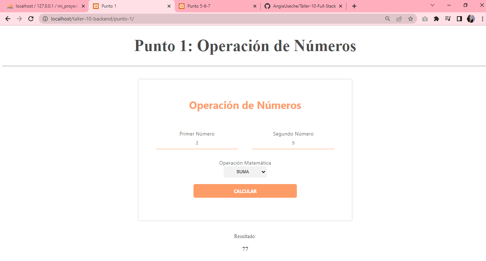
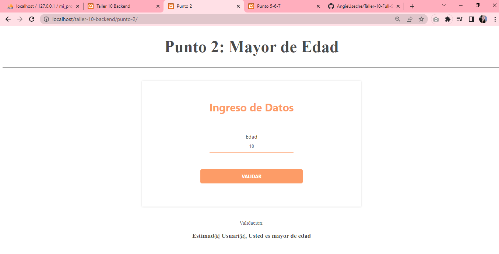
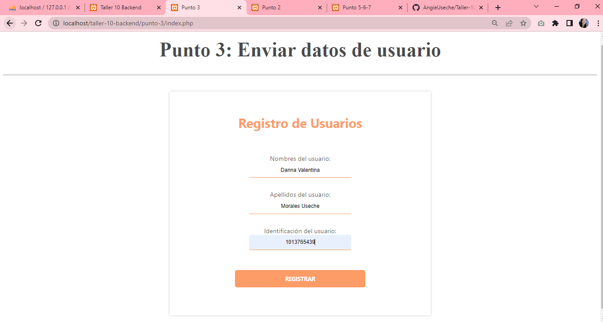
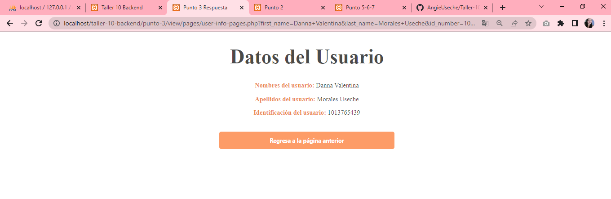
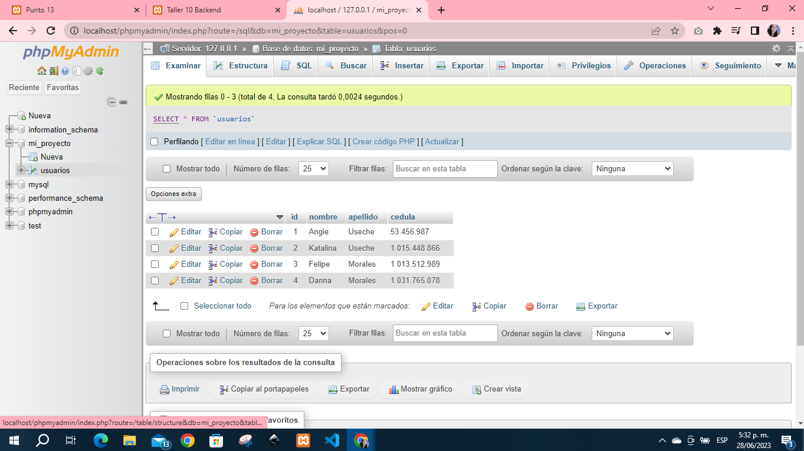
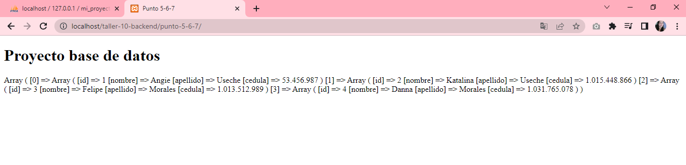
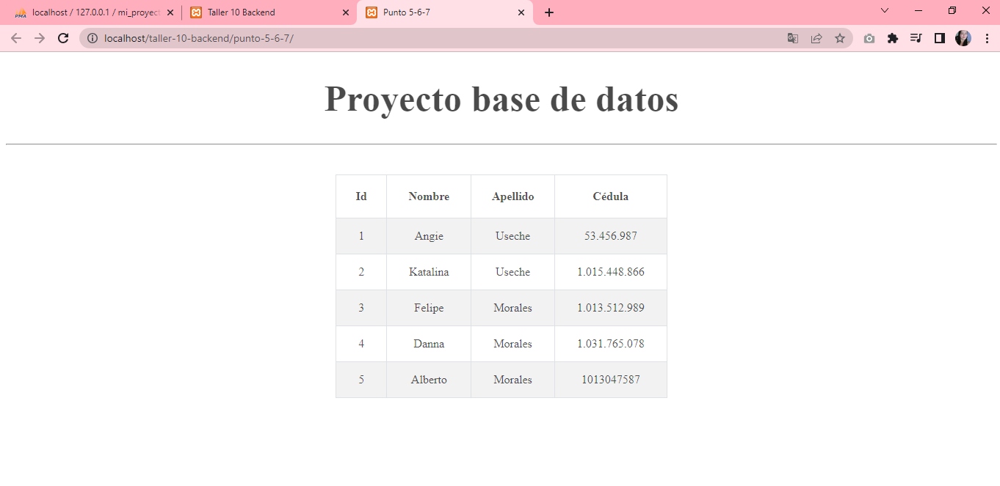

<h1>Taller 10: Backend </h1>
<h2>Angie Katherine Useche </h2>

<h2>Información</h2>
<b>
Curso: Full Stack Básico - Grupo 1

Profesor: Cristian Patiño
</b>

<h2>Punto 1: Operación de 2 números</h2>

<h2>Punto 2: Mayor de edad </h2>

<h2>Punto 3: Datos de Usuario en otra página</h2>

<h2>Punto 4: </h2>
<h2>Punto 5, 6 y 7: </h2>

<h3>5- Base de Datos</h3>

<h3>6- Conexion Base de Datos</h3>

<h3>7- Base de Datos en pantalla</h3>

